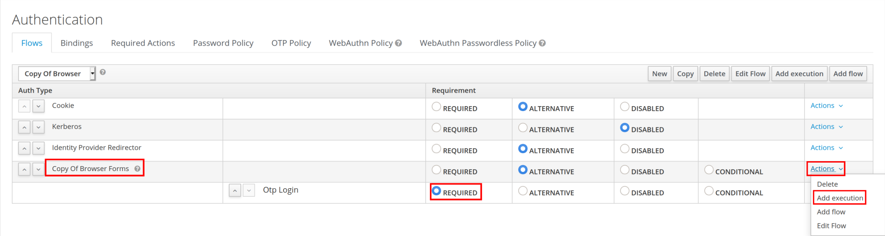
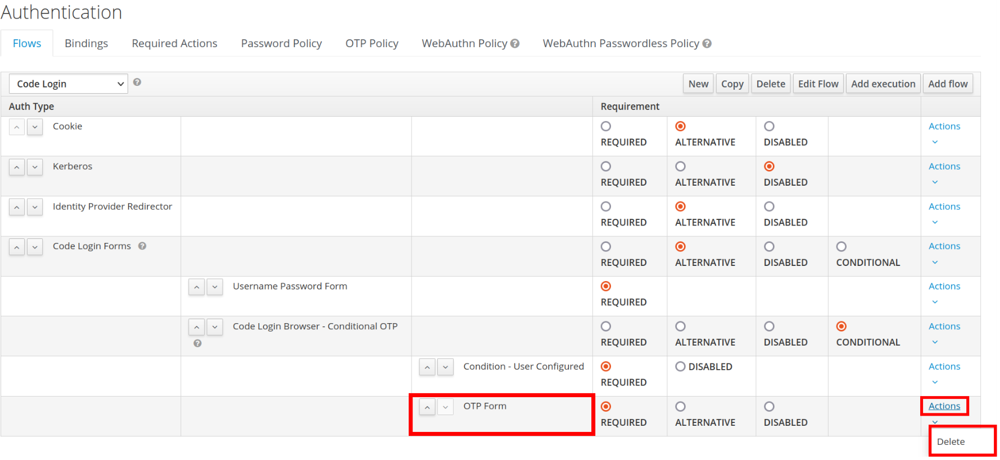
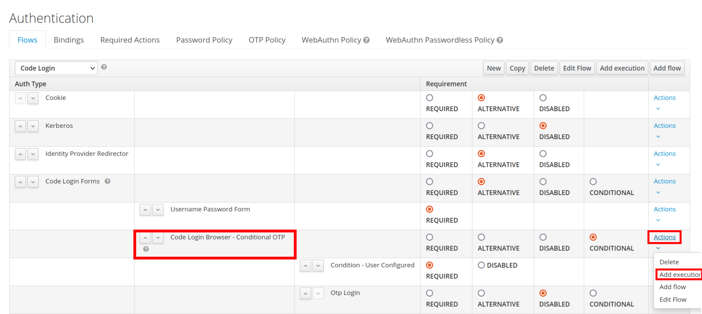
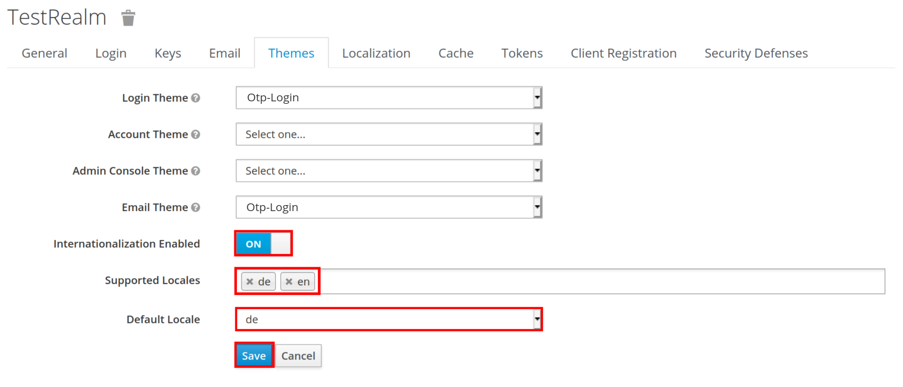

# What is keycloak-code-login?

It is an alternative authentication method, sending the user a different login code to their email for each login.
Usable instead of traditional passwords or as additional identity confirmation (two-step authentication).

It grants improved security, by removing the security issues of relying on user created passwords.

## Keycloak support

Developed and tested in Keycloak version 12.0.1.
Tested for 13.0.1.

## Testing

For the LoginFlowTest testing the Maildev container must be running. It can be started with the `restart.sh` script.

## How to configure in Keycloak

Once `keycloak-otp-login` is deployed on your server, (re-)start said server.

You can use `./restart.sh` in the root directory of the project.
 
Setup:

Now open the web admin console of keycloak, under Configure go to `Authentication`. In the `Flows` tab create a copy of the `Browser` flow.

1. Using instead of passwords
 
    1. Delete `Username Password Form` and `Browser - Conditional OTP` in your new flows Forms.
   
   
   
   
    1. Add a new execution to `*your flow name* Forms` using the `Otp-login` provider and set its requirement to `REQUIRED`.
   
   
   
   
1. Using as second step authentication
   
    1. Delete `OTP Form` in your new flows Forms.
   
   
   
   
    1. Add exec `*your flow name* Browser - Conditional OTP` using the `Otp-login` provider and set its requirement to `REQUIRED`.
    
   
   
   
Continue with:

1. Switch to the `Bindings` tab and change your Browser Flow to your new flow and save the settings.
   
   
   
   
1. Enable `Internationalization` and remove all the `Supported Locales` except `de` and `en` (and any languages you added) and set the `Default Locale` to your preference and save.
   
   
  
   
## Credit

 Inspired by [Magic Link authenticator for Keycloak](https://github.com/stianst/keycloak-experimental/tree/master/magic-link)
  
